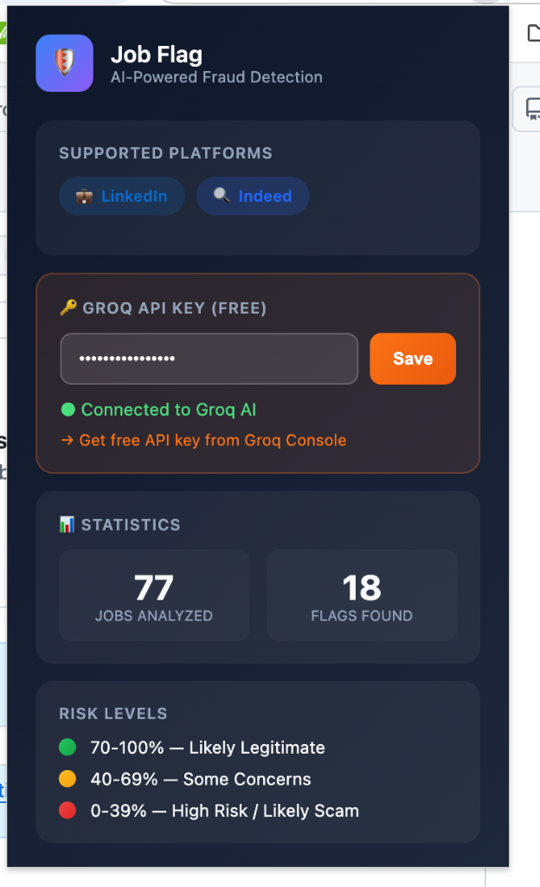

# 🛡️ Job Flag - AI-Powered Fake Job Detector

A Chrome extension that uses AI to detect and flag potentially fake or scam job postings on LinkedIn and Indeed.




## ✨ Features

- 🔍 **AI-Powered Analysis** - Uses Groq's Llama 3.1 model to analyze job postings for red flags
- 🌐 **Multi-Platform Support** - Works on LinkedIn and Indeed job listings
- 🎯 **Risk Scoring** - Provides a 0-100% legitimacy score for each job
- 💬 **Detailed Explanations** - Hover over badges to see why a job was flagged
- 📊 **Statistics Tracking** - Keep track of jobs analyzed and flags found
- 🆓 **Free to Use** - Uses Groq's free API tier

## 📦 Installation

### Option 1: Load Unpacked (Developer Mode)

1. **Download the extension**
   ```bash
   git clone https://github.com/sellamiam/job-flag-extension.git
   ```

2. **Open Chrome Extensions page**
   - Navigate to `chrome://extensions/` in your browser
   - Or go to **Menu → More Tools → Extensions**

3. **Enable Developer Mode**
   - Toggle the "Developer mode" switch in the top-right corner

4. **Load the extension**
   - Click "Load unpacked"
   - Select the `job-flag-extension` folder you downloaded

5. **Pin the extension** (optional)
   - Click the puzzle piece icon in your toolbar
   - Pin "Job Flag" for easy access

## 🔑 Setup - Getting Your Free Groq API Key

The extension uses Groq's AI (Llama 3.1) to analyze job postings. Groq offers a **free tier** that's more than enough for personal use.

### Step 1: Create a Groq Account

1. Go to [console.groq.com](https://console.groq.com)
2. Click **"Sign Up"** (or "Log In" if you have an account)
3. You can sign up with:
   - Google account
   - GitHub account
   - Email address

### Step 2: Generate an API Key

1. Once logged in, go to [console.groq.com/keys](https://console.groq.com/keys)
2. Click **"Create API Key"**
3. Give your key a name (e.g., "Job Flag Extension")
4. Click **"Submit"**
5. **Important**: Copy your API key immediately! You won't be able to see it again.

### Step 3: Configure the Extension

1. Click the **Job Flag** extension icon in your Chrome toolbar
2. Paste your API key in the input field
3. Click **"Save"**
4. You should see **"● Connected to Groq AI"** confirmation (as shown in the screenshot above)

## 🚀 Usage

1. **Navigate to a job listing** on LinkedIn or Indeed
2. **Wait for analysis** - The extension automatically analyzes job postings
3. **Check the badge** - Look for the risk indicator badge on the job listing:
   - 🟢 **70-100%** - Likely legitimate
   - 🟡 **40-69%** - Some concerns
   - 🔴 **0-39%** - High risk / Likely scam
4. **Hover for details** - Hover over the badge to see detailed analysis

## 🎯 What It Detects

The AI analyzes job postings for common scam indicators including:

- Unrealistic salary promises
- Vague job descriptions
- Requests for upfront payments
- Suspicious email domains
- Missing company information
- Work-from-home schemes with no requirements
- Pyramid scheme language
- Urgency tactics

## 🔒 Privacy

- Your data stays local - job data is only sent to Groq for analysis
- API keys are stored securely in Chrome's local storage
- No personal information is collected or shared
- View our [Privacy Policy](PRIVACY.md) for more details

## 🌐 Supported Platforms

| Platform | Status |
|----------|--------|
| LinkedIn | ✅ Supported |
| Indeed (US, CA, UK) | ✅ Supported |

## 🛠️ Technical Details

- **Manifest Version**: 3 (latest Chrome extension standard)
- **AI Model**: Groq Llama 3.1 70B
- **Permissions**: 
  - `activeTab` - Access current tab for job analysis
  - `storage` - Save API key and statistics

## 🤝 Contributing

Contributions are welcome! Feel free to:

1. Fork the repository
2. Create a feature branch (`git checkout -b feature/amazing-feature`)
3. Commit your changes (`git commit -m 'Add amazing feature'`)
4. Push to the branch (`git push origin feature/amazing-feature`)
5. Open a Pull Request

## 📝 License

This project is licensed under the MIT License - see the [LICENSE](LICENSE) file for details.

## ⚠️ Disclaimer

This extension is a tool to help identify potentially fraudulent job postings. It uses AI analysis which may not be 100% accurate. Always:

- Do your own research on companies
- Never pay money to get a job
- Verify company information through official channels
- Trust your instincts if something feels wrong

---

**Made with ❤️ to protect job seekers**
